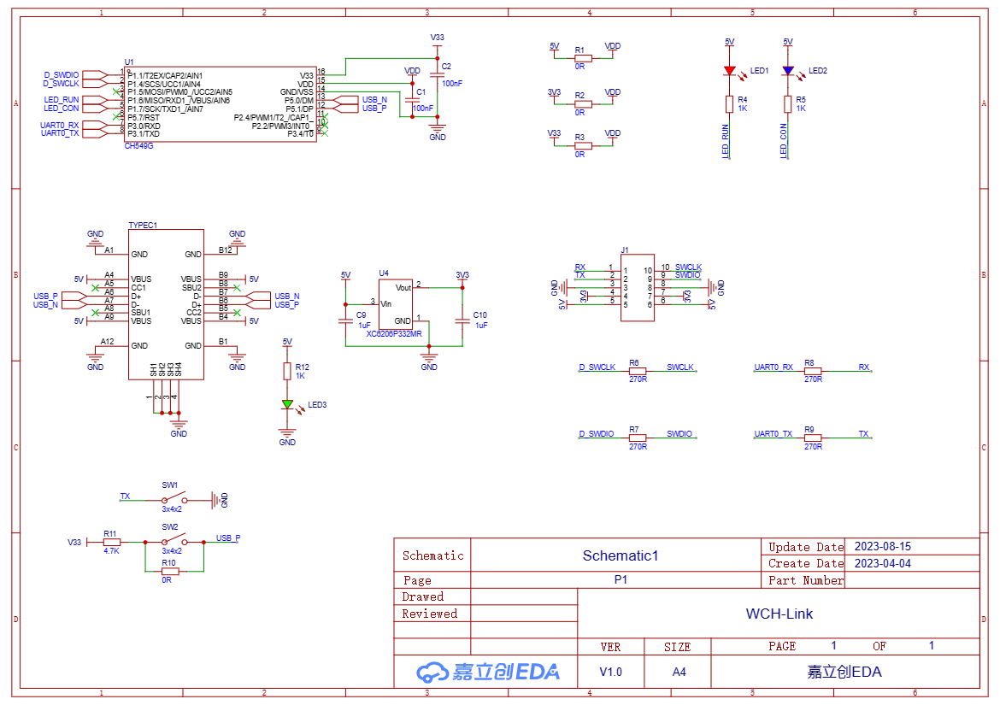
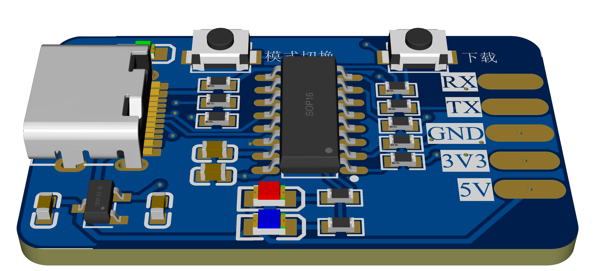

# WCH-Link

WCH-Link模块可用于沁恒 RISC-V 架构 MCU 在线调试和下载, 也可用于带有 SWD/JTAG 接口的 ARM 内核 MCU 在线调试和下载。同时带有一路串口, 方便调试输出。

调试的主控是沁恒 `CH549G` 芯片，价格在 4 元左右，相比于 ST-link 价格十分低廉。可以替代 ST-link 用于 ARM 内核 MCU 的调试。PCB 使用立创 EDA 绘制。

## 原理图：

## PCB:

## 固件烧录：

使用 `WCHISPTool` 工具下载固件：

按住下载按钮，点击`下载` 下载程序。

`WCH-LinkUtility` 工具可以修改下载器的模式：

+ 蓝色 LED 点亮为 ARM 模式
+ 蓝色 LED 熄灭为 RISC-V 模式

## 使用方法

WCH-Link 与 DAP-Link 的用法相同。

Keil 中的调试配置，将 Debug 设置为 CMSIS-DAP：

